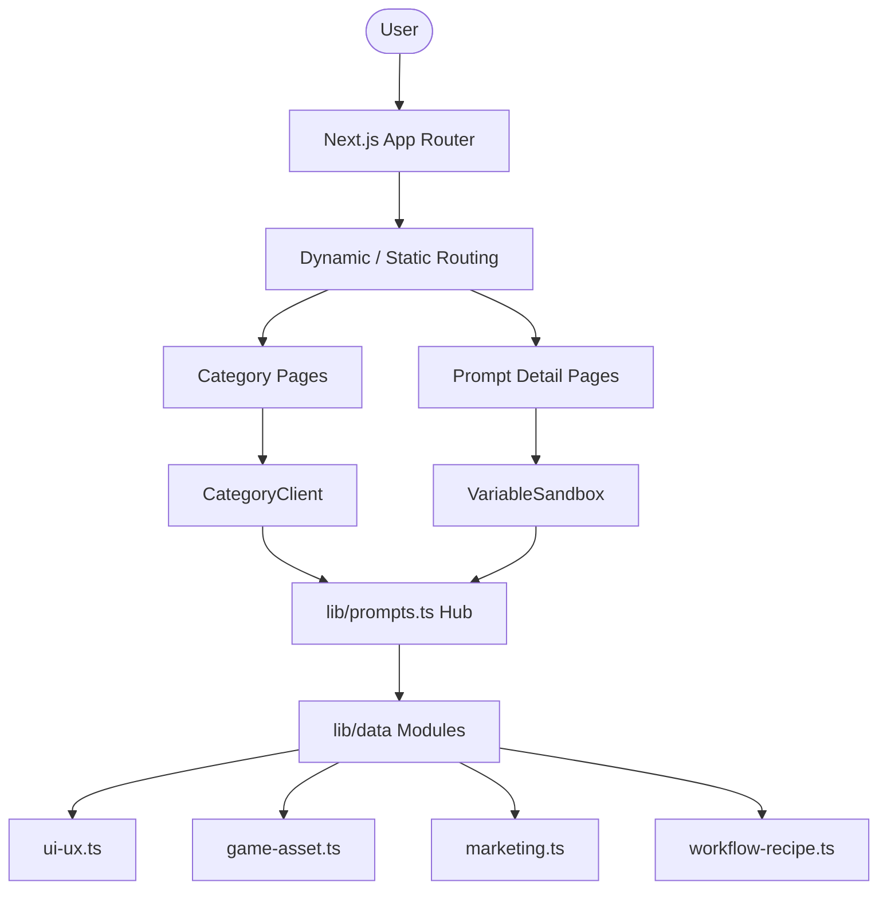

# System Map (2026-05-07)

## Project Overview
- **Name**: PromptFlow (`prompt.lego-sia.com`)
- **Core Value**: Visual-first 프롬프트 라이브러리 및 탐색 플랫폼.
- **Tech Stack**: Next.js (App Router), TypeScript, Vanilla CSS (Premium Aesthetics).

## Directory Structure
- `app/`: Next.js App Router 기반 페이지 구성.
  - `prompt/[slug]/`: 개별 프롬프트 상세 페이지 (Dynamic Routing).
  - `category/[slug]/`: 카테고리별 탐색 페이지 (Static Params 적용).
  - `about/`: 서비스 전략 및 소개.
- `components/`: 재사용 가능한 프리미엄 UI 컴포넌트.
  - `PromptCard.tsx`: 프롬프트 시각 정보 및 요약 표시.
  - `CategoryClient.tsx`: 카테고리별 데이터 렌더링 및 필터.
  - `VariableSandbox.tsx`: 프롬프트 변수 수정 및 가상 결과 가이드.
- `lib/`: 핵심 비즈니스 로직 및 모듈화 데이터.
  - `data/`: 카테고리별 프롬프트 데이터셋.
    - `ui-ux.ts`: 25개 UI/UX 프레임워크.
    - `game-asset.ts`: 20개 게임 에셋 프레임워크.
    - `marketing.ts`: 20개 마케팅/이커머스 프레임워크.
    - `workflow-recipe.ts`: 20개 비즈니스/크리에이터 워크플로우.
  - `prompts.ts`: 데이터 통합 허브 및 검색 유틸리티.
  - `types.ts`: PromptCard 인터페이스 등 타입 정의.
- `public/`: 정적 자산 (고해상도 WebP 이미지 저장소).
- `.gravityBrain/`: 프로젝트 장기 기억, 페르소나, 그랜드 전략.

## Architecture Diagram

## External Dependencies
- Midjourney v6, DALL-E 3, SDXL (Prompt Reference)
- Next.js 14, Framer Motion, Lucide React
